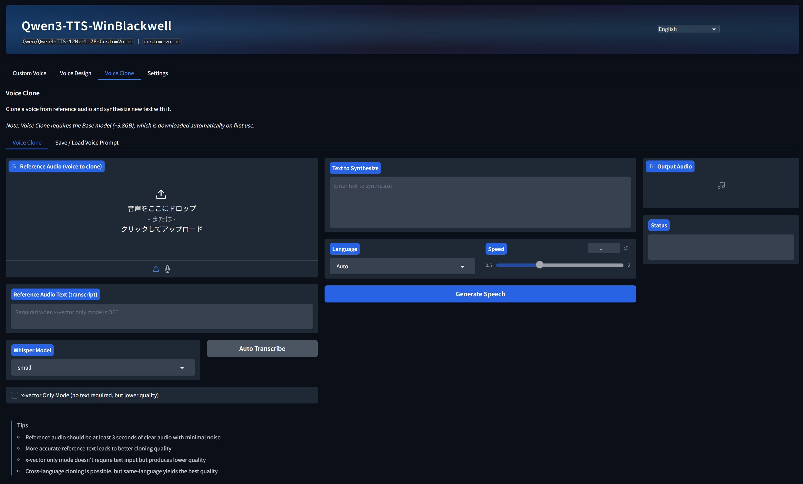

# Qwen3-TTS-JP-MeCab

[English](docs/README_en.md) | **日本語** | [中文](docs/README_zh.md) | [한국어](docs/README_ko.md) | [Русский](docs/README_ru.md) | [Español](docs/README_es.md) | [Italiano](docs/README_it.md) | [Deutsch](docs/README_de.md) | [Français](docs/README_fr.md) | [Português](docs/README_pt.md)

> ⚠️ **このリポジトリは日本語専用です。**  
> MeCab による日本語テキスト前処理を追加した日本語特化版です。

---

## Qwen3-TTS-JP との相違点

| 項目 | [Qwen3-TTS-JP](https://github.com/hiroki-abe-58/Qwen3-TTS-JP) | **本リポジトリ（Qwen3-TTS-JP-MeCab）** |
|---|---|---|
| 対象言語 | 多言語（10言語UI） | **日本語専用** |
| テキスト前処理 | なし | **MeCab + pyopenjtalk-plus による漢字読み変換** |
| アクセント解析 | なし | **MeCab辞書のアクセント情報を表示** |
| ユーザー辞書 | なし | **固有名詞・専門用語の読み・アクセントを登録可能** |
| MeCab | 不要 | **別途インストール必要** |
| 起動方法 | venv Python | **システム Python（pyopenjtalk のため）** |
| 無音挿入 | なし | **「……」と句点（。！？）後に無音を挿入可能** |

---

## 特徴

### Qwen3-TTS-JP の全機能を継承

- **Windowsネイティブ動作**: WSL2/Docker不要、FlashAttention2不要
- **Custom Voice**: プリセット話者による音声合成
- **Voice Design**: テキストで声の特徴を記述して合成
- **Voice Clone**: 参照音声からボイスクローン（Whisper自動文字起こし付き）
- **RTX 50シリーズ対応**: PyTorch nightlyビルド（cu128）

### 追加機能（日本語前処理）

- **漢字 → 読み仮名 自動変換**: MeCab + pyopenjtalk-plus でTTS用ひらがなに変換
- **アクセント記号表示**: `↑`（上昇）`↓`（下降）付きで読みを確認・編集可能
- **ユーザー辞書対応**: `user_dict.json` に固有名詞を登録、正確な読みとアクセントを設定
- **アクセント辞書統合**: [MeCab_accent_tool](https://github.com/mark10als/MeCab_accent_tool) でコンパイルした `.dic` を自動認識
- **無音挿入**: `……` で指定秒数、`。！？` でその半分の無音を挿入

### スクリーンショット

**Voice Clone タブ（日本語前処理パネル付き）**
<p align="center">
    
</p>

---

## 動作環境

- **OS**: Windows 10/11（ネイティブ環境）
- **GPU**: NVIDIA GPU（CUDA対応）
  - RTX 30/40シリーズ: PyTorch安定版で動作
  - RTX 50シリーズ（Blackwell）: PyTorch nightlyビルド（cu128）が必要
- **Python**: 3.10以上
- **VRAM**: 8GB以上推奨
- **MeCab**: 別途インストール必要（後述）

---

## インストール

### ステップ 1: MeCab 本体のインストール（必須・別途）

MeCab はシステムへの個別インストールが必要です。仮想環境とは独立しています。

1. 以下からインストーラをダウンロードしてインストール:  
   👉 **https://github.com/ikegami-yukino/mecab/releases**  
   （`mecab-64-*.exe` を選択、インストール時に文字コードは **UTF-8** を選択）

2. インストール確認（コマンドプロンプトで）:
   ```cmd
   mecab --version
   ```

3. インストールパスを確認（デフォルト）:
   ```
   C:\Program Files\MeCab\
   C:\Program Files\MeCab\dic\ipadic\   ← 辞書ディレクトリ
   ```

### ステップ 2: リポジトリのクローン

```bash
git clone https://github.com/mark10als/Qwen3-TTS-JP-MeCab.git
cd Qwen3-TTS-JP-MeCab
```

### ステップ 3: 仮想環境の作成と基本パッケージのインストール

```bash
python -m venv .venv
.venv\Scripts\activate
pip install -e .
pip install faster-whisper
```

### ステップ 4: PyTorch（CUDA対応版）のインストール

```bash
# CUDA 12.x の場合
.venv\Scripts\pip install torch torchvision torchaudio --index-url https://download.pytorch.org/whl/cu124

# RTX 50シリーズ（sm_120）の場合
.venv\Scripts\pip install --pre torch torchvision torchaudio --index-url https://download.pytorch.org/whl/nightly/cu128
```

### ステップ 5: 日本語前処理パッケージのインストール（システム Python に）

> **重要**: 起動ランチャー `launch_gui-2.py` はシステム Python を使用します。  
> 日本語前処理パッケージはシステム Python にインストールしてください。

```cmd
:: システム Python のパスを確認
where python

:: 以下をシステム Python で実行（仮想環境を有効化しないこと）
python -m pip install mecab-python3
python -m pip install pyopenjtalk-plus

:: marine は文字コードエラー回避のため PYTHONUTF8=1 が必要
set PYTHONUTF8=1
python -m pip install marine
set PYTHONUTF8=
```

インストール確認:

```python
python -c "import MeCab; print('MeCab: OK')"
python -c "import pyopenjtalk; print('pyopenjtalk-plus: OK')"
python -c "import marine; print('marine: OK')"
```

### ステップ 6: MeCab_accent_tool のセットアップ（推奨）

固有名詞・専門用語のアクセントを正確に設定するためのツールです。

```bash
git clone https://github.com/mark10als/MeCab_accent_tool.git
```

詳細は [MeCab_accent_tool の README](https://github.com/mark10als/MeCab_accent_tool) を参照してください。

---

## 使用方法

### GUI の起動

`launch_gui-2.py` をダブルクリック、または:

```bash
python launch_gui-2.py
```

ブラウザで `http://127.0.0.1:7860` が自動的に開きます。

> **注意**: `.venv\Scripts\python.exe` ではなく **システム Python** で実行してください。  
> pyopenjtalk-plus はシステム Python にインストールされているためです。

### 日本語テキストの合成手順

1. Voice Clone / Custom Voice / Voice Design タブを開く
2. 「合成するテキスト」に日本語テキストを入力
3. 日本語が検出されると自動的に「**MeCab前処理**」チェックボックスが有効化・チェックされる
4. 「**変換と解析**」ボタンをクリック
   - 「変換後テキスト」: TTS に渡すひらがな読みが表示される（編集可能）
   - 「アクセント記号付き読み」: `↑`/`↓` 付きで読みとアクセントを確認できる（編集可能）
5. 必要に応じてテキストを修正
6. 「**音声生成**」ボタンをクリック

### 無音挿入機能

テキスト中の特定記号の後に無音を挿入できます:

| 記号 | 無音時間 |
|---|---|
| `……`（六点リーダー） | スライダー設定値（秒） |
| `。` `！` `？` | スライダー設定値 × 0.5（秒） |

「**無音時間**」スライダー（0〜3秒）で調整してください。

### ユーザー辞書の設定

`user_dict.json` に固有名詞を登録できます:

```json
{
  "伝の心": {
    "reading": "でんのしん",
    "accent_type": 3,
    "note": "重度障害者用意思伝達装置（パナソニック製）"
  }
}
```

アクセント型の意味:
- `0`: 平板型（例: お↑かね）
- `1`: 頭高型（例: あ↓たま）
- `N`: N拍目で下降（例: `3` → で↑んの↓しん）

---

## MeCab_accent_tool との連携

[MeCab_accent_tool](https://github.com/mark10als/MeCab_accent_tool) でアクセント辞書 `.dic` をコンパイルすると、  
本リポジトリは自動的に検出して使用します。

```
MeCab_accent_tool/ でコンパイル
    ↓ output/mecab_accent.dic を生成
Qwen3-TTS-JP-MeCab/ の preprocess_block.py が自動検出
    ↓ mecab_accent.dic のアクセント型（14番目フィールド）を使用
```

`.dic` ファイルのパスは `mecab_accent.dic`（プロジェクトルート直下）を自動認識します。

---

## 関連パッケージ

| パッケージ | バージョン | 用途 | インストール先 |
|---|---|---|---|
| [mecab-python3](https://github.com/SamuraiT/mecab-python3) | 1.0以上 | Python から MeCab を使用 | システム Python |
| [pyopenjtalk-plus](https://github.com/tsukumijima/pyopenjtalk) | 0.4以上 | 読み変換・アクセント予測 | システム Python |
| [marine](https://github.com/6gsn/marine) | 0.0.6以上 | DNN アクセント予測（精度向上） | システム Python |
| [gradio](https://github.com/gradio-app/gradio) | 6.0以上 | Web UI | venv |
| [torch](https://pytorch.org/) | 2.4以上 | 推論エンジン | venv |
| [faster-whisper](https://github.com/SYSTRAN/faster-whisper) | - | 自動文字起こし | venv |

---

## トラブルシューティング

| 症状 | 原因 | 解決策 |
|---|---|---|
| `pyopenjtalk-plus 読み込み失敗` | システム Python にインストールされていない | `python -m pip install pyopenjtalk-plus`（システム Python で） |
| `MeCab前処理` チェックボックスが出ない | MeCab または pyopenjtalk が未インストール | ステップ 1・5 を確認 |
| `torch_library_impl` DLL エラー | venv Python で起動した場合 | `launch_gui-2.py`（システム Python）で起動 |
| `FlashAttention2 cannot be used` | FlashAttentionがWindows非対応 | `--no-flash-attn` オプションが付いているか確認 |
| `SoX could not be found` | SoX未インストール | 無視可能（基本機能に影響なし） |
| アクセントが表示されない | mecab_accent.dic がない | MeCab_accent_tool でコンパイルする |

---

## ライセンス

本プロジェクトは [Apache License 2.0](LICENSE) の下で公開されています。

### 使用しているオープンソースソフトウェア

| ソフトウェア | ライセンス | 著作権 |
|---|---|---|
| [Qwen3-TTS](https://github.com/QwenLM/Qwen3-TTS) | Apache License 2.0 | Copyright 2026 Alibaba Cloud |
| [Qwen3-TTS-JP](https://github.com/hiroki-abe-58/Qwen3-TTS-JP) | Apache License 2.0 | Copyright hiroki-abe-58 |
| [faster-whisper](https://github.com/SYSTRAN/faster-whisper) | MIT License | Copyright SYSTRAN |
| [mecab-python3](https://github.com/SamuraiT/mecab-python3) | BSD License | Copyright SamuraiT |
| [pyopenjtalk-plus](https://github.com/tsukumijima/pyopenjtalk) | MIT License | Copyright tsukumijima |
| [marine](https://github.com/6gsn/marine) | Apache License 2.0 | Copyright 6gsn |

詳細は [NOTICE](NOTICE) ファイルを参照してください。

---

## 免責事項

- 生成された音声はAIによる自動生成であり、不正確な内容が含まれる場合があります
- **他者の声を無断で複製・使用することは肖像権・パブリシティ権の侵害となる可能性があります**
- 本ソフトウェアの使用によって生じたいかなる損害についても、開発者は責任を負いません

---

## 謝辞

- オリジナル Qwen3-TTS: [Alibaba Cloud Qwen Team](https://github.com/QwenLM)
- Windows 対応フォーク元: [Qwen3-TTS-JP](https://github.com/hiroki-abe-58/Qwen3-TTS-JP) by hiroki-abe-58
