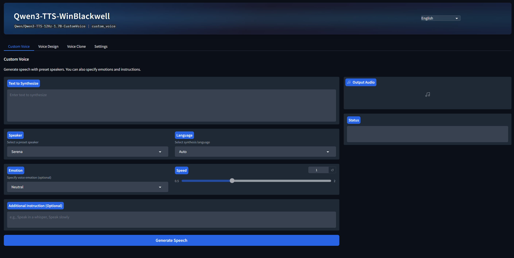
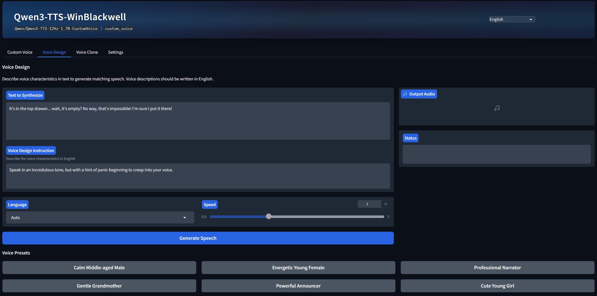
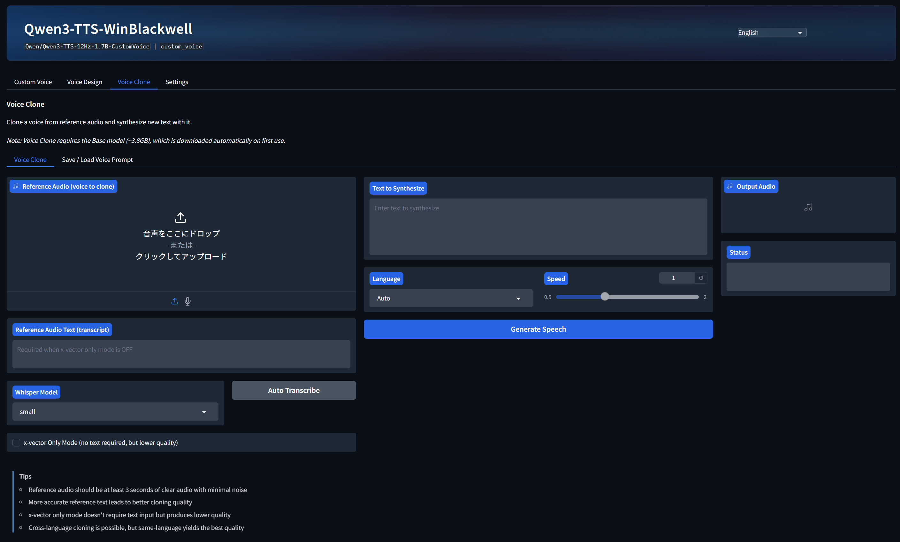
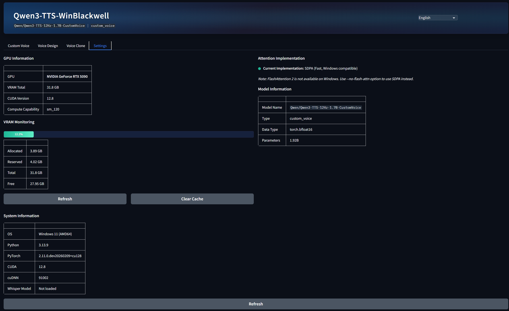

[English](../README.md) | [日本語](README_ja.md) | [中文](README_zh.md) | [한국어](README_ko.md) | [Русский](README_ru.md) | [Español](README_es.md) | [Italiano](README_it.md) | [Deutsch](README_de.md) | **Français** | [Português](README_pt.md)

# Qwen3-TTS-JP

Fork de Qwen3-TTS avec **support multilingue** et **support natif Windows**.

Le Qwen3-TTS original a été développé principalement pour les environnements Linux, et l'utilisation de FlashAttention 2 est recommandée. Cependant, FlashAttention 2 ne fonctionne pas sous Windows. Ce fork permet l'**exécution directe sous Windows sans WSL2 ni Docker**, fournit une interface en 10 langues et ajoute la transcription automatique via Whisper.

> **Utilisateurs Mac (Apple Silicon) :** Pour la meilleure experience sur Mac, utilisez **[Qwen3-TTS-Mac-GeneLab](https://github.com/hiroki-abe-58/Qwen3-TTS-Mac-GeneLab)** -- entierement optimise pour Apple Silicon avec double moteur MLX + PyTorch, quantification 8bit/4bit et interface Web en 10 langues.

### Voix personnalisée -- Synthèse vocale avec des locuteurs prédéfinis
<p align="center">
    
</p>

### Conception vocale -- Décrire les caractéristiques vocales pour synthétiser
<p align="center">
    
</p>

### Clonage vocal -- Cloner la voix à partir d'un audio de référence
<p align="center">
    
</p>

### Paramètres -- GPU / VRAM / Informations sur le modèle
<p align="center">
    
</p>

## Projets associés

| Plateforme | Dépôt | Description |
|:---:|---|---|
| Windows | **Ce dépôt** | Support natif Windows + interface en 10 langues |
| macOS (Apple Silicon) | [Qwen3-TTS-Mac-GeneLab](https://github.com/hiroki-abe-58/Qwen3-TTS-Mac-GeneLab) | Version entièrement optimisée pour Apple Silicon Mac (double moteur MLX + PyTorch, interface Web en 10 langues) |

## Caractéristiques

### Support natif Windows

- **FlashAttention 2 non requis** : Utilise le SDPA (Scaled Dot Product Attention) standard de PyTorch via l'option `--no-flash-attn`
- **WSL2/Docker non requis** : Exécution directe sous Windows
- **Support RTX série 50** : Instructions d'installation des builds nightly de PyTorch pour l'architecture NVIDIA Blackwell (sm_120) incluses
- **Pas de dépendance à SoX** : Fonctionne sans SoX (des avertissements sont affichés mais peuvent être ignorés)

### Interface Web moderne et support multilingue

- **UI en 10 langues**: japonais / English / chinois / coreen / russe / espagnol / italien / Deutsch / Francais / portugais -- changement instantane via le menu deroulant
- **4 onglets**: Custom Voice / Voice Design / Voice Clone / Settings -- acces a toutes les fonctionnalites quel que soit le type de modele ; les modeles non charges sont telecharges automatiquement lors de la premiere utilisation
- **Surveillance GPU / VRAM**: consultation de l'utilisation en temps reel dans l'onglet parametres, nettoyage du cache CUDA disponible
- **Transcription automatique Whisper**: automatise la saisie du texte audio de reference lors du clonage vocal ([faster-whisper](https://github.com/SYSTRAN/faster-whisper))
- **Selection du modele Whisper**: choix parmi 5 modeles selon vos besoins
  - `tiny` - Le plus rapide et le plus petit (39M parametres)
  - `base` - Rapide (74M parametres)
  - `small` - Equilibre (244M parametres) *Par defaut
  - `medium` - Haute precision (769M parametres)
  - `large-v3` - Precision maximale (1550M parametres)

## Configuration requise

- **Système d'exploitation** : Windows 10/11 (environnement natif, WSL2 non requis)
- **GPU** : GPU NVIDIA (compatible CUDA)
  - RTX série 30/40 : Fonctionne avec la version stable de PyTorch
  - RTX série 50 (Blackwell) : Nécessite le build nightly de PyTorch (cu128)
- **Python** : 3.10 ou supérieur
- **VRAM** : 8 Go ou plus recommandés (varie selon la taille du modèle)

## Installation

### 1. Cloner le dépôt

```bash
git clone https://github.com/hiroki-abe-58/Qwen3-TTS-JP.git
cd Qwen3-TTS-JP
```

### 2. Créer et activer l'environnement virtuel

```bash
python -m venv .venv
.venv\Scripts\activate
```

### 3. Installer les dépendances

```bash
pip install -e .
pip install faster-whisper
```

### 4. Installer PyTorch (version CUDA)

Installez selon votre version de CUDA.

```bash
# Pour CUDA 12.x
pip install torch torchvision torchaudio --index-url https://download.pytorch.org/whl/cu124

# Pour RTX série 50 (sm_120), le build nightly est requis
pip install --pre torch torchvision torchaudio --index-url https://download.pytorch.org/whl/nightly/cu128
```

## Utilisation

### Lancer l'interface graphique

#### Depuis la ligne de commande

```bash
# Modèle CustomVoice (voix prédéfinies)
qwen-tts-demo Qwen/Qwen3-TTS-12Hz-1.7B-CustomVoice --ip 127.0.0.1 --port 7860 --no-flash-attn

# Modèle Base (avec clonage vocal)
qwen-tts-demo Qwen/Qwen3-TTS-12Hz-1.7B-Base --ip 127.0.0.1 --port 7860 --no-flash-attn
```

Ouvrez `http://127.0.0.1:7860` dans votre navigateur.

#### Lancement rapide avec des fichiers batch (recommandé)

Créez un fichier batch comme suit pour un lancement en double-clic :

**run-gui.bat** (pour le modèle CustomVoice) :
```batch
@echo off
chcp 65001 >nul
title Qwen3-TTS GUI
cd /d "%~dp0"
.venv\Scripts\python.exe -m qwen_tts.cli.demo Qwen/Qwen3-TTS-12Hz-1.7B-CustomVoice --ip 127.0.0.1 --port 7860 --no-flash-attn
pause
```

**run-voice-clone.bat** (pour le modèle Base / clonage vocal) :
```batch
@echo off
chcp 65001 >nul
title Qwen3-TTS Voice Clone
cd /d "%~dp0"
.venv\Scripts\python.exe -m qwen_tts.cli.demo Qwen/Qwen3-TTS-12Hz-1.7B-Base --ip 127.0.0.1 --port 7860 --no-flash-attn
pause
```

#### Lanceur avancé (sélection automatique du port et ouverture automatique du navigateur)

Pour une méthode de lancement plus pratique, vous pouvez utiliser le lanceur Python suivant :

<details>
<summary>launch_gui.py (cliquez pour développer)</summary>

```python
# coding=utf-8
import socket
import subprocess
import sys
import time
import webbrowser
import threading
import urllib.request
import urllib.error

def find_free_port(start_port=7860, max_attempts=100):
    """Trouver un port disponible"""
    for port in range(start_port, start_port + max_attempts):
        try:
            with socket.socket(socket.AF_INET, socket.SOCK_STREAM) as s:
                s.bind(('127.0.0.1', port))
                return port
        except OSError:
            continue
    raise RuntimeError(f"Tous les ports {start_port}-{start_port + max_attempts} sont utilisés")

def wait_for_server_and_open_browser(url, timeout=180):
    """Attendre le démarrage du serveur et ouvrir le navigateur"""
    start_time = time.time()
    while time.time() - start_time < timeout:
        try:
            req = urllib.request.Request(url, method='HEAD')
            urllib.request.urlopen(req, timeout=2)
            webbrowser.open(url)
            return True
        except (urllib.error.URLError, ConnectionRefusedError, TimeoutError):
            time.sleep(2)
    return False

def main():
    port = find_free_port(7860)
    url = f"http://127.0.0.1:{port}"
    
    threading.Thread(target=wait_for_server_and_open_browser, args=(url, 180), daemon=True).start()
    
    subprocess.run([
        sys.executable, "-m", "qwen_tts.cli.demo",
        "Qwen/Qwen3-TTS-12Hz-1.7B-Base",  # ou CustomVoice
        "--ip", "127.0.0.1",
        "--port", str(port),
        "--no-flash-attn"
    ])

if __name__ == "__main__":
    main()
```

</details>

Fonctionnalités :
- **Sélection automatique du port** : Détecte automatiquement un port libre si le 7860 est occupé
- **Ouverture automatique du navigateur** : Détecte la fin du démarrage du serveur et ouvre automatiquement le navigateur
- **Correction de l'encodage** : Support de l'encodage UTF-8

### Étapes du clonage vocal

1. Téléchargez un fichier audio dans « Audio de référence »
2. Sélectionnez un modèle dans « Modèle Whisper » (le premier téléchargement peut prendre du temps)
3. Cliquez sur « Transcription automatique »
4. Le résultat de la transcription est automatiquement saisi dans « Texte de l'audio de référence »
5. Modifiez le texte si nécessaire
6. Saisissez le « Texte à synthétiser »
7. Cliquez sur « Générer l'audio »

### Détails du support natif Windows

Ce fork permet le fonctionnement natif sous Windows grâce aux mesures suivantes :

| Problème | Original | Solution de ce fork |
|----------|----------|---------------------|
| FlashAttention 2 | Linux uniquement, impossible à compiler sous Windows | Utilisation de SDPA via l'option `--no-flash-attn` |
| Dépendance à SoX | Installation supposée | Fonctionne sans (les avertissements peuvent être ignorés) |
| RTX série 50 | Non supporté | Instructions d'installation du build nightly incluses |
| Configuration de l'environnement | conda (orienté Linux) | venv (standard Windows) |

**Remarque** : L'option `--no-flash-attn` est obligatoire. Sans elle, l'application ne démarrera pas en raison d'une erreur d'importation de FlashAttention 2.

## Configuration détaillée de l'environnement natif Windows

### Problèmes techniques résolus

Au cours du développement de ce fork, les problèmes spécifiques à Windows suivants ont été identifiés et résolus :

#### 1. Support CUDA pour RTX série 50 (Blackwell/sm_120)

**Problème** : La version stable de PyTorch ne supporte pas les GPU les plus récents comme la RTX 5090 (sm_120)

```
RuntimeError: CUDA error: no kernel image is available for execution on the device
NVIDIA GeForce RTX 5090 with CUDA capability sm_120 is not compatible with the current PyTorch installation.
```

**Solution** : Utiliser la version nightly de PyTorch (cu128)

```bash
pip install --pre torch torchvision torchaudio --index-url https://download.pytorch.org/whl/nightly/cu128
```

#### 2. FlashAttention 2 non compatible avec Windows

**Problème** : FlashAttention 2 est exclusif à Linux et ne peut être compilé ni exécuté sous Windows

```
ImportError: FlashAttention2 has been toggled on, but it cannot be used due to the following error: 
the package flash_attn seems to be not installed.
```

**Solution** : Utiliser le SDPA (Scaled Dot Product Attention) standard de PyTorch via l'option `--no-flash-attn`

| Implémentation Attention | Vitesse | Efficacité mémoire | Support Windows |
|--------------------------|---------|--------------------|-----------------| 
| flash_attention_2 | Maximale | Optimale | Non supporté |
| sdpa (PyTorch native) | Rapide | Bonne | **Supporté** |
| eager (standard) | Normale | Normale | Supporté |

#### 3. Suppression de la dépendance à SoX

**Problème** : Certains traitements audio nécessitent SoX, mais il n'est pas installé par défaut sous Windows

```
SoX could not be found!
```

**Solution** : Les fonctionnalités de base de Qwen3-TTS fonctionnent sans SoX. Les avertissements peuvent être ignorés en toute sécurité.

#### 4. Caractères corrompus dans la console (encodage cp932)

**Problème** : Dans les environnements japonais de Windows, les caractères non ASCII sont corrompus en raison de l'encodage cp932

```
UnicodeEncodeError: 'cp932' codec can't encode character...
```

**Solution** : Définir explicitement l'encodage UTF-8

```python
import sys
import io
sys.stdout = io.TextIOWrapper(sys.stdout.buffer, encoding='utf-8', errors='replace')
sys.stderr = io.TextIOWrapper(sys.stderr.buffer, encoding='utf-8', errors='replace')
```

Ou exécuter `chcp 65001` dans le fichier batch

#### 5. Avertissement de compatibilité torchao

**Problème** : Avertissement dû à une incompatibilité de version entre PyTorch nightly et torchao

```
Skipping import of cpp extensions due to incompatible torch version 2.11.0.dev+cu128 for torchao version 0.15.0
```

**Solution** : Simple avertissement, sans impact sur le fonctionnement. Peut être ignoré.

#### 6. Avertissement sur les liens symboliques Hugging Face

**Problème** : La création de liens symboliques sous Windows nécessite des droits d'administrateur

```
huggingface_hub cache-system uses symlinks by default...
```

**Solution** : 
- Activer le Mode développeur dans les paramètres Windows
- Ou ignorer l'avertissement (sans impact sur le fonctionnement)

### Script de vérification

Pour vérifier que l'environnement est correctement configuré :

```python
import torch

print(f"PyTorch version: {torch.__version__}")
print(f"CUDA available: {torch.cuda.is_available()}")
print(f"CUDA version: {torch.version.cuda}")
print(f"GPU: {torch.cuda.get_device_name(0)}")
print(f"GPU Memory: {torch.cuda.get_device_properties(0).total_memory / 1024**3:.1f} GB")
```

Sortie attendue (pour RTX 5090) :

```
PyTorch version: 2.11.0.dev20260123+cu128
CUDA available: True
CUDA version: 12.8
GPU: NVIDIA GeForce RTX 5090
GPU Memory: 31.8 GB
```

### Dépannage

| Symptôme | Cause | Solution |
|----------|-------|----------|
| `no kernel image is available` | Utilisation de la version stable de PyTorch | Installer la version nightly (cu128) |
| `FlashAttention2 cannot be used` | FlashAttention non supporté sous Windows | Ajouter l'option `--no-flash-attn` |
| `SoX could not be found` | SoX non installé | Peut être ignoré (sans impact sur les fonctionnalités de base) |
| GPU non reconnue | Pilote CUDA obsolète | Installer le dernier pilote |
| Caractères corrompus | Encodage cp932 | `chcp 65001` ou configuration UTF-8 |

## Licence

Ce projet est publié sous la [Apache License 2.0](../LICENSE).

### Logiciels open source utilisés

| Logiciel | Licence | Droits d'auteur |
|----------|---------|----------------|
| [Qwen3-TTS](https://github.com/QwenLM/Qwen3-TTS) | Apache License 2.0 | Copyright 2026 Alibaba Cloud |
| [faster-whisper](https://github.com/SYSTRAN/faster-whisper) | MIT License | Copyright SYSTRAN |
| [OpenAI Whisper](https://github.com/openai/whisper) | MIT License | Copyright OpenAI |

Pour plus de détails, consultez le fichier [NOTICE](../NOTICE).

## Avertissement

### Avertissement concernant la génération audio

- L'audio généré par ce système est produit automatiquement par un modèle d'IA et peut contenir du contenu inexact ou inapproprié
- L'audio généré ne représente pas les opinions des développeurs et ne constitue pas un conseil professionnel
- Les utilisateurs assument tous les risques et responsabilités liés à l'utilisation, la distribution ou la confiance accordée à l'audio généré

### Avertissement sur le clonage vocal

- **Cloner ou utiliser la voix d'une autre personne sans son consentement peut constituer une violation des droits à l'image et des droits de publicité**
- Veuillez utiliser la fonction de clonage vocal uniquement à des fins légales avec le consentement de la personne dont la voix est clonée
- L'utilisation à des fins malveillantes telles que la fraude, l'usurpation d'identité, la diffamation ou les deepfakes est strictement interdite

### Responsabilité juridique

- Les développeurs n'assument aucune responsabilité pour les dommages résultant de l'utilisation de ce logiciel
- Toute responsabilité juridique découlant d'une utilisation illégale sera assumée par l'utilisateur
- Ce logiciel est fourni « tel quel » sans aucune garantie

## Remerciements

- Développeur original : [Alibaba Cloud Qwen Team](https://github.com/QwenLM)
- Dépôt original : [QwenLM/Qwen3-TTS](https://github.com/QwenLM/Qwen3-TTS)

## Citation

Pour citer le Qwen3-TTS original :

```BibTeX
@article{Qwen3-TTS,
  title={Qwen3-TTS Technical Report},
  author={Hangrui Hu and Xinfa Zhu and Ting He and Dake Guo and Bin Zhang and Xiong Wang and Zhifang Guo and Ziyue Jiang and Hongkun Hao and Zishan Guo and Xinyu Zhang and Pei Zhang and Baosong Yang and Jin Xu and Jingren Zhou and Junyang Lin},
  journal={arXiv preprint arXiv:2601.15621},
  year={2026}
}
```
